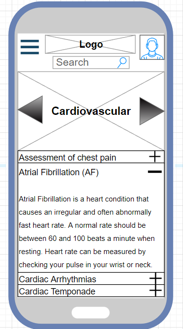
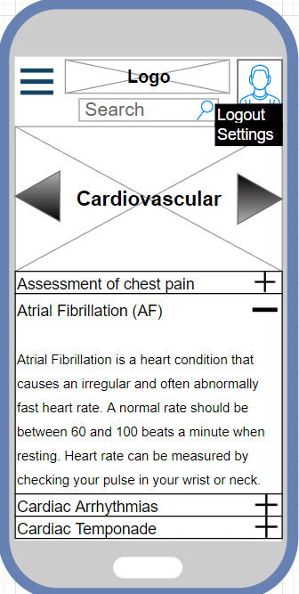
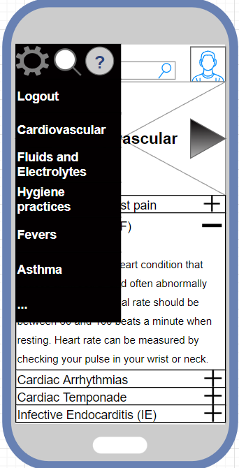
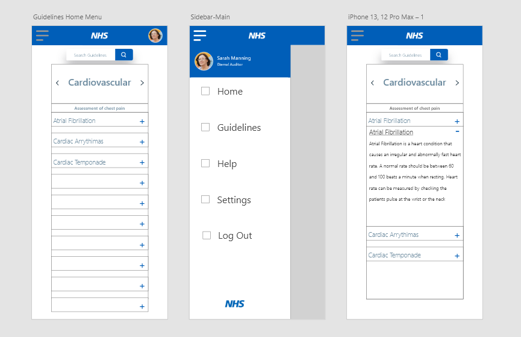

# NHS Guidelines Application

This unofficial application is designed for NHS Doctors and Clinicians to view guidelines for specific conditions. These guidelines are stored in a database and are created by System Authors who use the built in features of the app to create consistently styled guidelines. These are then checked and approved by External Auditors, who can make changes to the guidelines.

---
## Application GUI

**Here are some wireframes for what we think the finished product should look like:**

| Wireframe | Description |
| ----------- | ----------- |
|  | Figure 1: Guidelines homepage on a mobile phone. This is the first page that the user will see if they successfully login to the app. A carousel method is used to navigate between different categories of guidelines. |
|  | Figure 2:  User settings on the guidelines homepage. The user can either logout and return to the login page or they can access the settings page of the app where they can change the appearance of the app to improve accessibility. |
|  | Figure 3: The guidelines homepage with an extended hamburger menu. The menu shows the different categories of guidelines that the user can visit while providing options to logout of the app, view the settings and search for specific guidelines. |

Figure 4: Three wireframes - one for the home menu, another for the sidebar menu and the last for the dropdown of a specific guideline.

---
## Checklist of implemented features:

- [] Create navigateable GUI
- [] Create database
- [] Implement a login system
- [] Create guidelines editor
- [] Populate database 
- [] Use populated database to test application

---
## Download
**Type in terminal:**

`git clone https://github.com/Thomas-monke/NHS-Guidelines-Application/`

Then in android studio, go to File, then Open... and navigate to the directory that the git clone command was run and open it.

To download android studio: https://developer.android.com/studio
